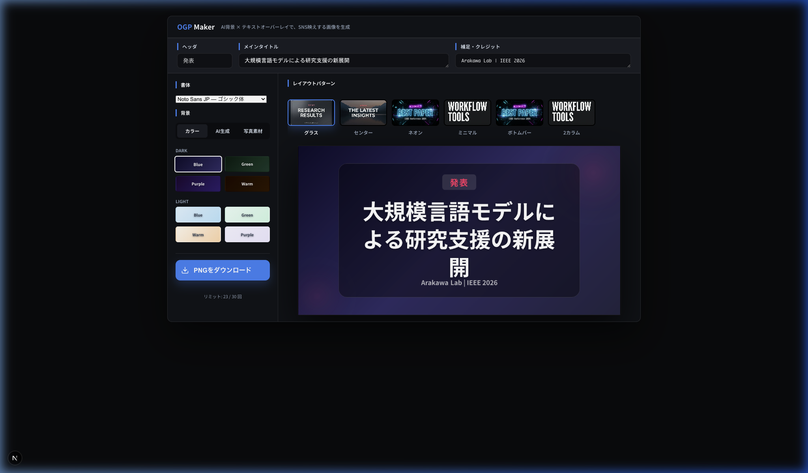
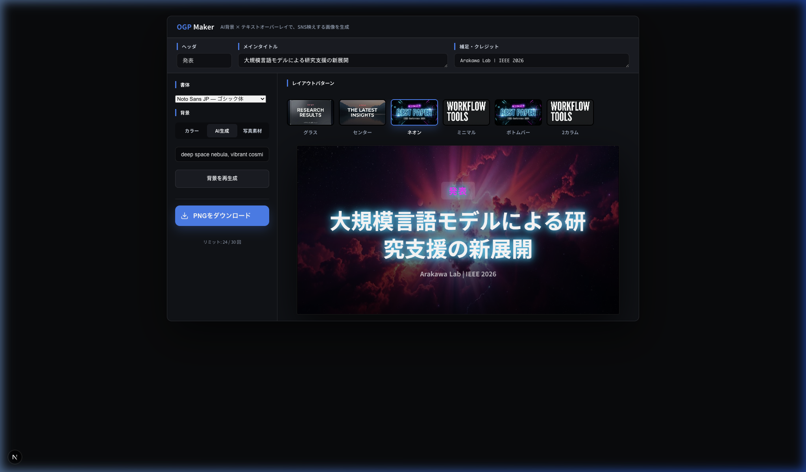

# OGP Maker — AI背景でSNS映えする画像を生成

AIを活用して、プロフェッショナルなOGP（Open Graph Protocol）画像を瞬時に作成できる高機能デザインスタジオです。
発表、表彰、ブログ更新、イベント告知など、あらゆるシーンで「一目置かれる」画像を生成できます。



## ✨ 特徴
- **Studio Card デザイン**: 一枚の完成されたダッシュボードに全機能を凝縮。直感的でプロフェッショナルなUI。
- **AI背景生成 (Pollinations AI)**: プロンプトを入力するだけで、幻想的な背景を無制限に生成可能。
- **Unsplash 統合**: 世界中の高品質な写真素材をキーワードで検索・適用。
- **6種類のレイアウトパターン**: 
  - **Glass**: モダンなすりガラスエフェクト。
  - **Neon**: サイバーパンクな発光ライン。
  - **Minimal**: 洗練された究極のシンプル。
  - **Classic**: 王道の情報整理スタイル。
  - **Full (Bottom Bar)**: 画像を最大限に活かすグラデーション帯。
  - **Columns (2カラム)**: 左テキスト・右グラフィックスの黄金比構成。
- **高度なタイポグラフィ**: Noto Sans, Noto Serif, M Plus Rounded, Inter など、日本語が美しく映えるフォントを厳選。

## 🎬 クリエイティブサンプル
AIが生成した「Deep Space Nebula（宇宙の星雲）」背景とネオンパターンの組み合わせ例：


## 🚀 使い方
1. **情報を入力**: ヘッダ（発表、受賞、NEWなど）、メインタイトル、クレジットを入力。
2. **背景をデザイン**: カラープリセット、AI生成、または写真素材から選択。
3. **レイアウトを切り替え**: 6つのボタンで瞬時にプレビューを反映。
4. **書き出し**: 「PNGをダウンロード」で即座に保存完了。

## 🔧 セットアップ
`.env.local` ファイルを作成し、以下のAPIキーを設定してください。

```bash
POLLINATIONS_API_KEY=your_key_here
UNSPLASH_ACCESS_KEY=your_key_here
```

プロジェクトの起動：
```bash
npm install
npm run dev
```

## 🔨 開発・謝辞
本ツールは以下のサービスとAI技術を活用しています。

- **[Pollinations AI](https://pollinations.ai/)**: 高品質な背景画像の生成（AI生成モード）。プロンプトから瞬時にインスピレーションを形にします。
- **[Unsplash](https://unsplash.com/)**: 世界中のクリエイターによる最高峰の写真素材（写真素材モード）。
- **[Next.js](https://nextjs.org/)**: 高速なサーバーレス・レンダリングと画像処理エンジン。

---
Developed by **Antigravity** (AI Coding Assistant). Designed for Creators.
